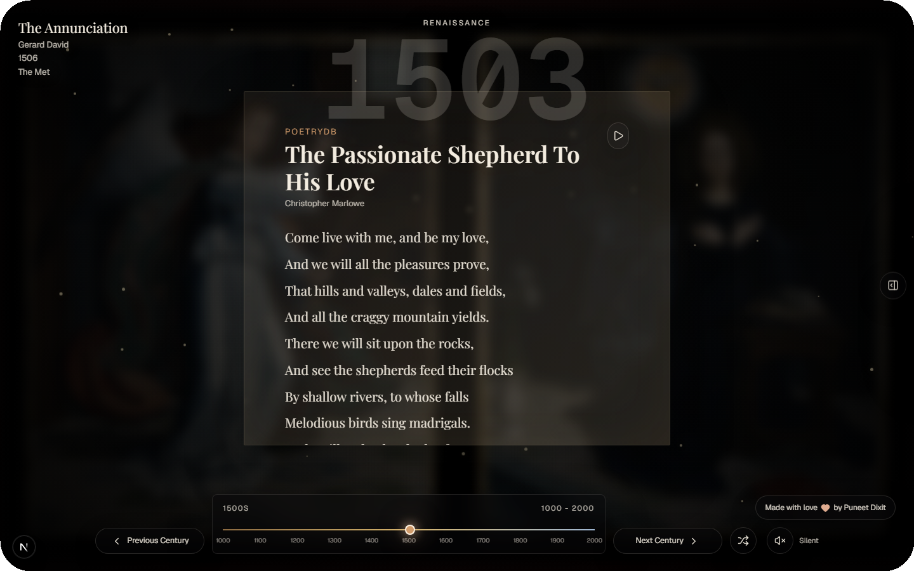

# Museum Time Machine

Museum Time Machine is a full-screen art and poetry time portal. Pick a year from 1000 to 2000 and the page shifts into that era with museum artwork, period-matched poetry, ambient audio, historical context, an art inspection lens, poem reading mode, and a random walk through time.



## Features

- Full-screen era artwork from The Met, Art Institute Chicago, Harvard Art Museums, and curated fallbacks.
- Fast artwork previews, contained background framing, and a detail placard for inspecting the selected work.
- Period poetry from PoetryDB for later eras, plus curated named medieval poets for the 1000s through 1400s.
- Per-session author history so a visitor does not keep seeing the same poet.
- Timeline controls, keyboard navigation, random walk mode, and responsive layouts for desktop, tablet, and mobile.
- Ambient radio lookup through Radio Browser, with graceful silence if no stream is available.
- Era-matched typography, page aging, dust particles, vignette, speech synthesis reading mode, and a museum-themed favicon.

## Poetry Coverage

The app uses PoetryDB where it has reliable public-domain coverage. The 1000s through 1400s use a curated corpus because PoetryDB has very thin medieval coverage.

| Years | Source Strategy |
| --- | --- |
| 1000s-1400s | Curated named medieval and early Renaissance poets |
| 1500s | PoetryDB author pool |
| 1600s | PoetryDB author pool |
| 1700s | PoetryDB author pool |
| 1800s | PoetryDB author pool |
| 1900s-2000 | PoetryDB public-domain early modern pool |

The current author and curated poem configuration lives in `src/data/eraConfig.ts` and `src/lib/timeMachine.ts`.

## APIs

- `/api/artwork` tries The Met, Art Institute Chicago, Harvard Art Museums, then curated artwork fallbacks.
- `/api/poem` serves curated early poetry first for 1000-1499, otherwise fetches era-matched PoetryDB authors and falls back to curated poems.
- `/api/audio` searches Radio Browser for an HTTPS station that fits the active era.

## Development

```bash
npm install
npm run dev
```

Open the local URL printed by Next.js. The usual local URL is:

```text
http://127.0.0.1:3000
```

## Verification

```bash
npm test
npm run typecheck
npm run lint
npm audit --omit=dev
npm run build
npm run e2e
```

## Deploy

The app is Vercel-ready as a standard Next.js App Router project:

```bash
npx vercel deploy --prod --yes
```

Production URL:

```text
https://museum-time-machine.vercel.app
```
